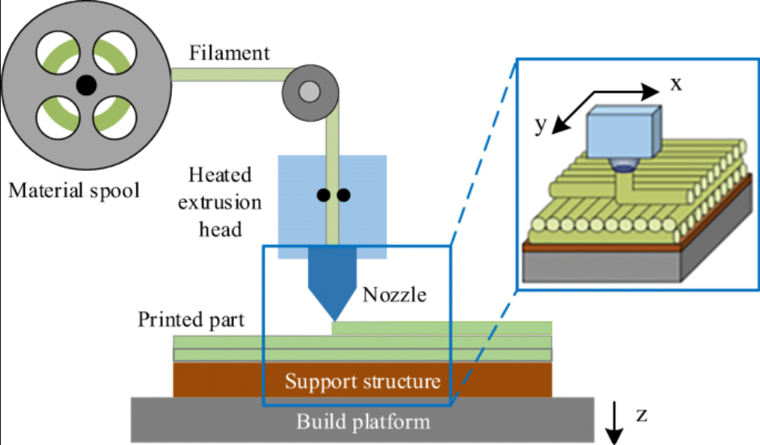
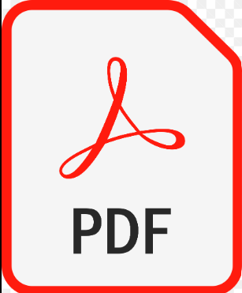

# 🖨️ IMPRESORA 3D Proyecto#2 MN

 Repositorio del Proyecto #2 de Métodos Numéricos, simulación de una Impresora 3D.
 
 Instrucciones para utilizar este programa:
1. Ejecutar en entorno de python:  
 - pip install -r Documentación/requirements.txt
2. Ejecutar Impresora3D.py

## INTEGRANTES: 

- **FREDDY JIMENEZ**
- **DAVID PILATAXI**
- **MIJAEL MOLINA**

## DESCRIPCIÓN. -

Una impresora 3D es una máquina que permite imprimir objetos tridimensionales a partir de un modelo digital. Para ello, la impresora 3D recorre la superficie del objeto capa por capa, de abajo hacia arriba, hasta cubrir el modelo.

## OBJETIVO. -

- Simular una impresora 3D que imprima un objeto bidimensional a partir de un archivo SVG

## INFORME DEL PROYECTO. -

Click aquí:

## DESCRIPCIÓN DEL CÓDIGO. -

Este código es una simulación gráfica de la trayectoria de una impresora 3D en un plano bidimensional (2D). La simulación utiliza una interfaz gráfica desarrollada con Tkinter y Matplotlib para cargar archivos SVG que representan figuras geométricas. Una vez cargado el archivo SVG, el programa permite configurar la resolución de impresión (a menor resolución, mayor es el tiempo de impresión) y también modificar la velocidad de dibujado. Finalmente, simula el proceso de llenado de la figura, mostrando una animación de cómo la impresora 3D recorrería la figura capa por capa.

## PRESENTACIÓN DEL PROYECTO. -

Click aquí:

## EJEMPLO DEL PROYECTO. -

Click aquí:

## TECNOLOGÍAS UTILIZADAS. -

La creación de este trabajo fue posible gracias a las siguientes herramientas:  

- Backend: Python, Tkinter, Matplotlib, xml.etree.ElementTree, NumPy

- Frontend: Tkinter (interfaz gráfica), Matplotlib (visualización)

- Colaboración: GitHub

- Presentación: Canva