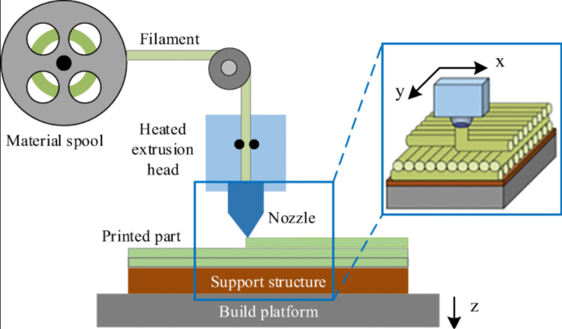

# IMPRESORA_3D-Proyecto2_MN

 Proyecto #2 de Métodos Numéricos, Impresora 3D

## INTEGRANTES: 

- **FREDDY JIMENEZ**
- **DAVID PILATAXI**
- **MIJAEL MOLINA**

## DESCRIPCION. -

Una impresora 3D es una máquina que permite imprimir objetos tridimensionales a partir de un modelo digital. Para ello, la impresora 3D recorre la superficie del objeto capa por capa, de abajo hacia arriba, hasta cubrir el modelo.

## OBJETIVO. -

- Simular una impresora 3D que imprima un objeto bidimensional a partir de un archivo SVG

## INFORME DEL PROYECTO. -

- Accede al informe del proyecto haciendo un click. -

## DESCRIPCION DEL CODIGO. -

- Este código simula la trayectoria de una impresora 3D vista bidimensional, lo cual usa una interfaz grafica para ingresar a los archivos svg y tiene opciones para poner las resoluciones de 0.1 hasta 0.5, luego genera la animacion de un llenado en el archivo svg lo cual es una figura, si es de 0.1 la resolucion se demorara en llenarse la figura, sino su ejecucion es más rapida si se pone la resolucion de 0.5. 

## PRESENTACION DEL PROYECTO. -

## EJEMPLO DEL PROYECTO. -

Hacer click en el video para ver su ejecución

